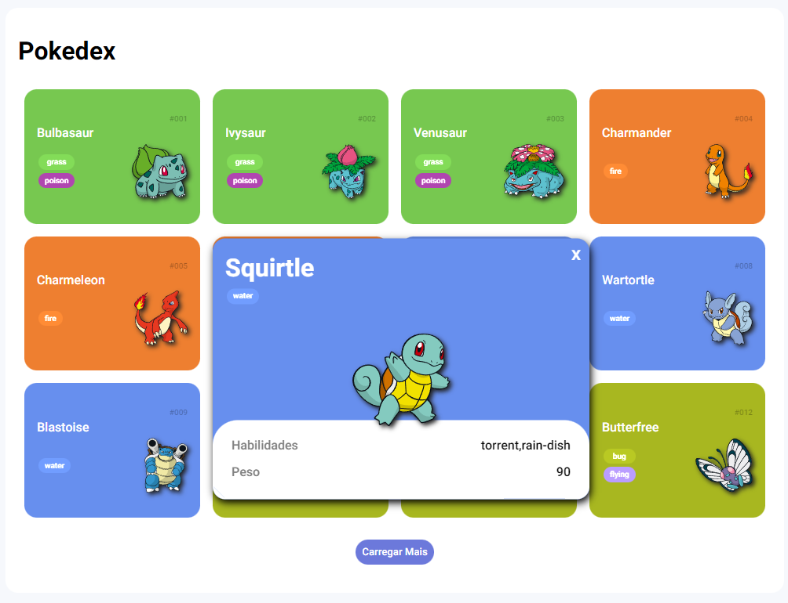

<h1 align="center"> JS Pokedex </h1>

Desenvolvido como desafio do curso de JS da DIO durante o bootcamp da orange tech com incrementos pessoais

  <a href="#-tecnologias">Tecnologias</a>&nbsp;&nbsp;&nbsp;|&nbsp;&nbsp;&nbsp;
  <a href="#-projeto">Projeto</a>&nbsp;&nbsp;&nbsp;|&nbsp;&nbsp;&nbsp;
  <a href="#memo-licença">Licença</a>

  

 

  

## 🚀 Tecnologias

Esse projeto foi desenvolvido com as seguintes tecnologias:

- HTML e CSS
- JavaScript
- Git e Github

## 💻 Projeto

A pokedex tem como intuito a listagem de pokemons inicialmente da primeira geraçao. O projeto possui modificaçoes proprias como um modal com mais detalhes do pokemon ao clicar no mesmo e pequenos detalhes de css.

## :memo: Licença

Esse projeto está sob a licença MIT.

---

Feito com ♥ by [LuPeBreak](https://github.com/LuPeBreak/) como um desafio durante os cursos de JS da [DIO](https://dio.me/)
